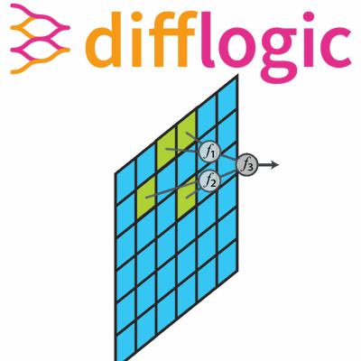
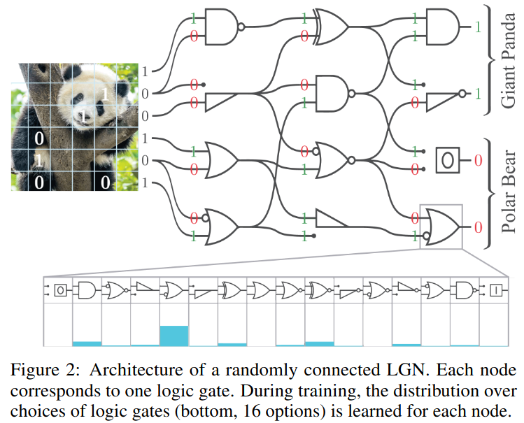
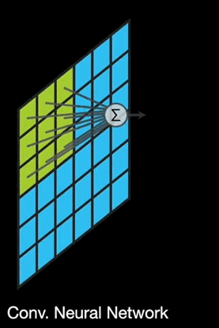
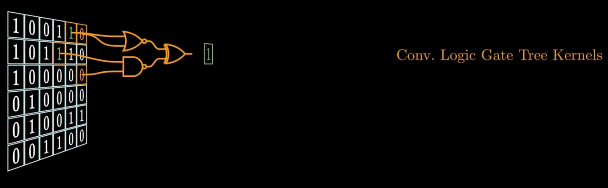
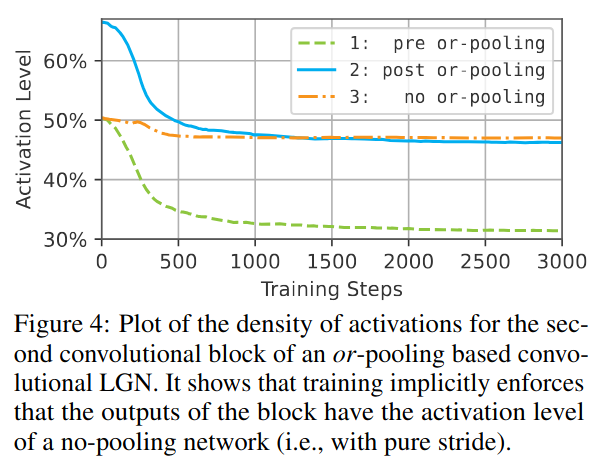
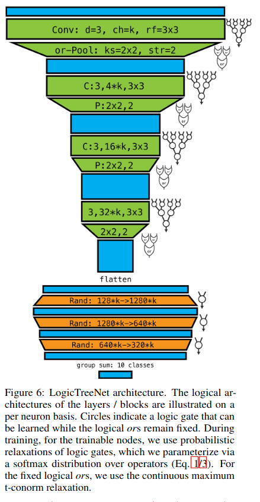
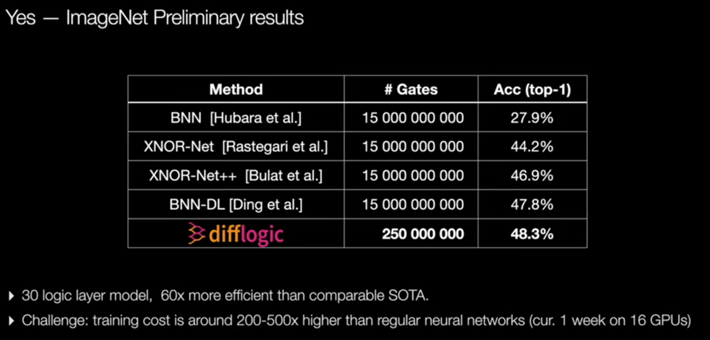
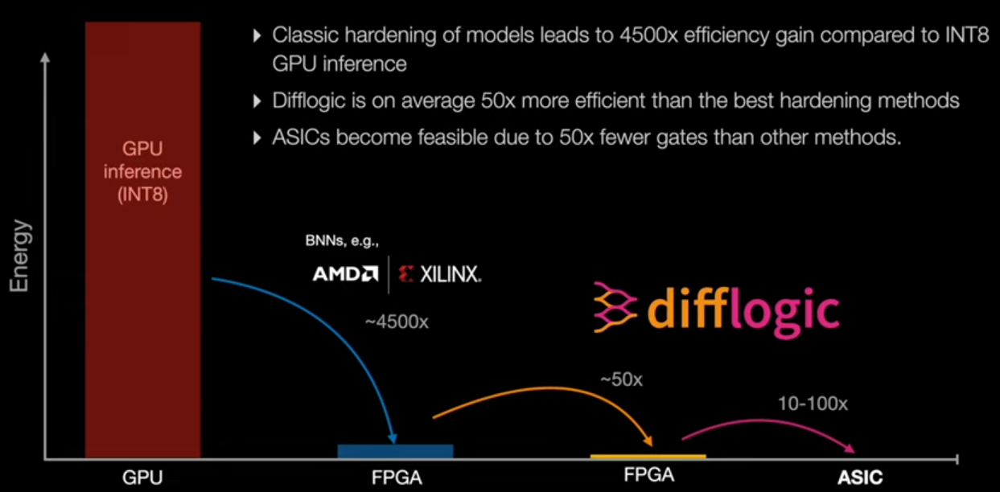

# Faster, Smarter, Greener: Achieving Unmatched Performance in Vision Models with Convolutional Differentiable Logic Gate Networks 🚀🧠🌱

**Authors**: Sabah Ahmed, Md. Raihan Sobhan, Tahsin Wahid  
**Date**: January 07, 2025

---

## Introduction 🌟

The 🖥️ computational demands of contemporary deep learning models have grown exponentially, raising significant concerns regarding their **efficiency⚡, scalability📈, and energy consumption🔋**. In the study *Convolutional Differentiable Logic Gate Networks*, the authors propose a groundbreaking methodology that synergizes logic-based computation🧠 with the adaptability of deep learning. This approach tackles computational inefficiencies🐢 and limitations in capturing spatial patterns intrinsic to traditional logic gate networks (*LGNs*), introducing a scalable📏 and convolution-enabled architecture.

---

## The problem with *Traditional Neural Networks* 🤖

- **Computational Expense** 💸: Resource-intensive matrix multiplications and floating-point operations.
- **Inefficiency of Translation** 🔄: Cumbersome translation to hardware logic.
- **Suboptimal Performance** 🐢: Reduced speed and accuracy.
- **Energy Consumption** 🔋: Increased energy demands.
- **Inductive Bias** 🎯: Limits flexibility and generalization.

The authors propose a novel architecture 🏗️ that integrates logic gates directly into the neural network, eliminating the need for translation and enabling more efficient hardware execution. This approach leverages the strengths of both neural networks 🧠 and logic gates 🔌, creating a powerful and scalable model. 🚀

---

## What are *Logic Gate Networks (LGNs)*? 🤔

- **Definition:** Networks composed of logic gates (e.g., *NAND*, *XOR*, *AND*) arranged in layers.
- **Input Encoding:** Inputs are encoded using binary encoding.
- **Structure:** Composed of layers, each with a number of nodes, each node containing one logic gate.
- **Non-Linearity:** Logic gates are inherently non-linear, eliminating the need for activation functions.
- **No Weights or Biases:** *LGNs* do not rely on matrix multiplications, so they have no weights or biases.
- **Sparsity:** Due to the binary nature of nodes, LGNs are sparse and cannot form fully-connected networks.
- **Random Connectivity:** Nodes are randomly connected, which works for simpler tasks but may struggle with structured data like images.
- **Fixed Connections:** During training, connections remain fixed, and the learning task is to choose the optimal logic gate at each node.
- **Optimization Challenge:** The task is an NP-hard combinatorial optimization problem.
- **Efficiency:** Can be executed extremely efficiently as combinational logic circuits.
- **Speed Up:** Directly training logic gate networks can achieve up to $7$ **OOM** (orders of magnitude) more efficient models compared to GPU inference.
- **Application:** Used for tasks like classification by grouping outputs into classes and computing class scores.

---
## Why *Convolutional Differentiable Logic Gate Networks (CDLGNs) are needed?* 🤔

- **Non-Differentiability** 🚫: Traditional *LGNs* are non-differentiable preventing gradient descent-based training, because at each node

  1. A logic gate computes a discrete function of its (Boolean) inputs, which is not differentiable.
  2. The choice of logic gate is not a continuous parameter, but a discrete decision, which is also not differentiable.

- **Combinatorial Problem** 🧩: Optimizing *LGNs* is a combinatorial problem, which becomes infeasible with millions of parameters or gates.
- **Training Efficiency** ⏱️: Differentiable relaxation of *LGNs* allows for gradient descent-based training, overcoming the exponential difficulty of optimization.
- **Scalability** 📈: *CDLGNs* enable scalable training of deeper networks by addressing the non-differentiability issue.
- **Enhanced Performance** 🚀: *CDLGNs* leverage the strengths of both neural networks 🧠 and logic gates 🔌, creating a powerful and scalable model.
- **Weight Sharing** ⚖️: *CDLGNs* share their weights of one kernel for all placements per convolution.
- **Capturing Spatial Relations** 🗺️: *CDLGNs* are better at capturing spatial patterns in images, crucial for tasks like image recognition.
- **Limited Depth** 📏: Differential LGNs perform well only up to a depth of $6$ layers, restricting the modeling of complex relationships which can be overcome by *CDLGNs*.
- **Computational Expense** 💸: Differential LGNs are very computationally expensive to train; e.g., a $5$ million gate network required $90$ hours on an A6000 GPU.

*CDLGNs* address these limitations by introducing
- *Convolutional Logic Tree Layers* 🌲
- *Logical OR Pooling*
- *Residual Initializations*

---

## CNNs vs CDLGNs

### Conventional Convolutional Neural Networks (CNNs)

### Convolutional Differentiable Logic Gate Networks (CDLGNs)

---

## Technical Implementation 🛠️

### Why 16 possible logic gates? 🔢

Each logic gate has $2$ inputs and $1$ output, where each input and output can be either $0$ or $1$. So if a logic gate is a function then it has to map $2^2 = 4$ possible input combinations to $2$ possible output values each. As there are $2$ possible output values, for each input combination, there are $2^4 = 16$ possible functions i.e logic gates.
Below is a list of all possible logic gates:

### Differentiable Relaxation 🧘

As LGNs are not differentiable, the authors proposed to differentiably relax each logic gate to real-valued logic via probabilistic logic shown in the above image. The authors also introduced a probability distribution over the $16$ possible logic gates ($\mathcal{S}$), which is encoded as the softmax of $16$ trainable parameters. For a trainable parameter vector $\mathbf{z} \in R^{16}$ and all $16$ possible logic gate operations as $g_0, \dots, g_{15}$, the differentiable logic gate as the expectation over its outputs can be computed in closed-form as

$$
f_z(a_1, a_2) = \mathbb{E}_{i \sim \mathcal{S}(z), A_1 \sim B(a_1), A_2 \sim B(a_2)} \left[ g_i(A_1, A_2) \right] = 
\sum_{i=0}^{15} \frac{\exp(z_i)}{\sum_{j} \exp(z_j)} \cdot g_i(a_1, a_2)
$$

With these two ingredients, logic gate networks become end-to-end differentiable.

### Residual Initialization 🚀

- **Problem with Existing *LGNs*:** 
  - Parameters $\mathbf{z}$ initialized from a Gaussian distribution lead to **washed out** probability distributions 🌊.
  - Expected activations converge towards $0.5$, causing **vanishing gradients** 🌀 and slowing training 🐢.

- **Proposed Solution: Residual Initializations** 🚀
  - Initialize each logic gate as a feedforwarding logic gate 🔌, choosing $A$ as the canonical choice.
  - Set the probability for $A$ to around $90\%$ 📈 and other gates to $0.67\%$ 📉.

- **Benefits:**
  - Prevents loss of information 🧠 and vanishing gradients 🌀.
  - Acts as a differentiable form of residual connections 🔄 without additional logic gates 🔌.
  - Enables efficient ⚡ and effective 💪 training of *LGNs* beyond $6$ layers.

  

### Training 🏋️

For classification tasks, class scores are computed by counting active neurons in the output layer and using them as logits in a softmax cross-entropy loss. The Adam optimizer is recommended for training, as softmax distributions typically converge to specific logic gates.

### Discretization 🔧

To deploy on hardware, differentiable *LGNs* can be converted to hard *LGNs* by selecting the logic gate with the highest probability, with minimal accuracy loss.

### Convolutional Logic Gate Tree Kernels 🌲

At the heart of this methodology lies the extension of *LGNs* through *convolutional logic tree kernels*. Unlike standard convolutional neural networks that rely on weighted sum operations of kernel filters, *CDLGNs* kernel filter concept is binary logic gates arranged in a hierarchical tree structure. This hierarchical arrangement
- enhances expressivity
- reduces memory and computational overhead
- captures **spatial correlations** more effectively, enabling its application to tasks like *image classification*.

The authors constructed each logic gate network kernel as a complete binary tree of depth $d$, with logic gates as nodes and binary input activations as leaves. The output of each logic gate operation serves as the input to the next higher node. To capture spatial patterns, inputs (leaves) of the tree are selected from the predefined receptive field of the kernel, sized $s_h \times s_w$. For example, a binary tree of depth $d = 2$ requires $2^2 = 4$ inputs, randomly selected from a receptive field of size $64 \times 3 \times 3$, corresponding to $64$ input channels with a kernel size of $3 \times 3$.

During training, the network learns which logic gate operation to choose at each node. Each logic tree kernel is parameterized by the choices of the $(2^d - 1)$ logic gates, which are learnable. For a logic kernel of depth $2$, these gates are $( f_1, f_2, f_3 )$. Given input activations $( a_1, a_2, a_3, a_4 )$, the kernel is expressed as a binary tree:

$$
f_3(f_1(a_1, a_2), f_2(a_3, a_4))
$$

For an input $A$ of shape $m \times h \times w$ ($m$ input channels; height $h$; width $w$) and connection index tensors $C_M, C_H, C_W$ each of shape $n \times 4$ ($n$ tree kernels i.e channels; $4$ inputs per tree), the output is:

$$
\textbf{A}' \left[ k, i, j \right] = 
f_3^k
( 
f_1^k
(
  \mathbf{A}[C_M[k,1], C_H[k,1]+i, C_W[k,1]+j],
  \mathbf{A}[C_M[k,2], C_H[k,2]+i, C_W[k,2]+j]
)
,
$$

$$
f_2^k
(
  \mathbf{A}[C_M[k,3], C_H[k,3]+i, C_W[k,3]+j],
  \mathbf{A}[C_M[k,4], C_H[k,4]+i, C_W[k,4]+j]
)
)
$$

for $k \in \{1, \dots, n\}$, where $n$ is the number of tree kernels, $i \in \{1, \dots, (h - s_h + 1)\}$, and $j \in \{1, \dots, (w - s_w + 1)\}$, where $s_h \times s_w$ being the receptive field size. For each output channel $k$ the logic gates $f^k_1, f^k_2, f^k_3$ are independently chosen and parameterized. Per convolution, all placements (indexed via $( i, j )$ of one kernel share their parameters.

- $C_M \in \{1, \dots, m\}^{n \times 4}$ indicates which out of $m$ input channels is selected
- $C_H \in \{1, \dots, s_h\}^{n \times 4}$ and $C_W \in \{1, \dots, s_w\}^{n \times 4}$ indicate the selected positions inside the receptive field of size $s_h \times s_w$

### Logical OR Pooling

In *CNNs*, max-pooling selects the largest activation over a predefined receptive field. To adapt this for logic, the authors propose using the disjunction of binary activations via the logical OR. Instead of a probabilistic relaxation, they use the *maximum t-conorm relaxation* $(\bot_{max}(a,b) = max(a,b))$. Setting the stride of the pooling operation to the size of its receptive field offers several advantages:
- **Faster Computation:** More efficient than probabilistic relaxation.
- **Storage Efficiency:** Only the maximum activation and index need to be stored.
- **Simplified Backpropagation:** Only backpropagate through the maximum activations during training.

Although using many logical ORs could lead to outputs of activations to be predominantly $1$, this is not an issue during training. *OR pooling* causes an automatic reduction of pre-pooling activations, preventing problematic saturation. This behavior emerges naturally during training without explicit regularization.

---

## LogicTreeNet Architecture 🌲

---

## Results and Key Findings 📊

The author evaluated the proposed *Convolutional Differentiable Logic Gate Networks (CDLGNs)* on **CIFAR-10** and **MNIST** dataset, comparing them with different **SOTA** models. The results demonstrate the superior performance of *CDLGNs* in terms of ***accuracy🎯, speed⚡, and efficiency💡*** achieving a range of new **SOTAs**.

### CIFAR-10 🖼️

- **Model Efficiency:**
  - $29\times$ $\text{--}$ $61\times$ fewer gates
  - **Model (M):** $3.08M$ gates, similar accuracy to *large TTNet* model but with only $1.6\%$ of the logic gates.
  - **Model (B):** $16M$ gates, matches *FINN* accuracy with a $56\times$ reduction in gates ($901M$ to $16M$).
  - **Model (L):** $28.9M$ gates, achieves $84.99\%$ accuracy, requiring $44.6\times$ fewer gates than *LUTNet* for comparable accuracy.
  - **Model (G):** $61M$ gates, achieves $86.29\%$ accuracy, matching *Network-in-Network XNOR-Net* with $29\times$ fewer gates.

  
  

- **FPGA Inference Time:**  
  - Achieves $41.6$ million FPS compared to *FINN's* $22K$ FPS, a $1900\times$ speed improvement.
  - **LogicTreeNet-S:** $60.38\%$ accuracy, $9$ ns per image.
  - **LogicTreeNet-M:** $71.01\%$ accuracy, $9$ ns per image.
  - **LogicTreeNet-B:** $80.17\%$ accuracy, $24$ ns per image. 

  

### MNIST 🖌️

- **Accuracy Improvement** 🎯:
  - Small model improves accuracy 📈 over *FINN* while reducing model size 📉 by $36\times$ and inference time ⏱️ by $160\times$.
  - Medium model achieves $99.23\%$ test accuracy 🧪, outperforming all $BNNs$ in the literature 📚.

- **Inference Time Reduction** ⏳:
  - Medium model reduces inference time ⏱️ by $30,000\times$ compared to *LowBitNN*, increasing throughput 🚀 from $6,600$ FPS to $200,000$ FPS.

- **Error Reduction**:
  - Decreases error from $1.99\%$ to $0.77\%$ compared to *LUTNet*.
  - Larger FPGA used by *LUTNet* could enable placing *LogicTreeNet-L* ($0.65\%$ error) multiple times for multiple classifications per cycle 🔄.

- **Efficiency and Accuracy** ⚡🎯:
  - Models are the most efficient ⚡ in the $\geq 98\%$ accuracy regime 🎯.
  - Highest accuracy models with up to $99.35\%$ accuracy 🏆.

  

---

### Is it Scalable? 📈

---

### Energy Efficiency 🌱

---

## Personal Insights 🌟

The paper 📄 represents a significant step forward 🚀 in integrating logic gate networks 🔌 with convolutional architectures 🏗️, highlighting the potential for creating more efficient ⚡ and powerful 💪 models for real-world 🌍 applications. This work signifies a paradigm shift 🔄 in neural network design 🧠 by starting at the hardware level 🔧 and building up 🏗️, rather than beginning with high-level abstractions 📊 and translating down to hardware 🔧. This approach could revolutionize edge computing 🌐 and IoT applications 📱 where computational efficiency ⚡ is paramount. The combination of theoretical advancements 📚 and practical results 🛠️ positions this work as a valuable contribution 🏆 to machine learning 🤖, particularly in the context of efficient deep learning inference.

---

## Future Directions 🚀

- **Embedded and Real-Time Systems** 📱  
  Ideal for IoT devices 🌐 and mobile applications 📲, enhancing tasks like image recognition 🖼️ and AR 🕶️.

- **Autonomous Systems** 🚗  
  Suitable for self-driving cars 🚘, drones 🚁, and robotics 🤖, improving real-time object detection 👀 and navigation 🧭.

- **Healthcare and Medical Imaging** 🏥  
  Useful in medical image analysis 🩺 and wearable health monitors ⌚ for real-time data analysis 📊.

- **Advanced Computer Vision Tasks** 🖼️  
  Extendable to complex tasks like object localization 📍, tracking 👣, and scene understanding 🏞️.

- **Integration with Other ML Techniques** 🤝  
  Potential for hybrid models 🧬 with traditional neural networks 🧠, reinforcement learning 🎓, and transfer learning 🔄.

- **Research on Logic Gate Networks** 🔍  
  Explore new logic gate designs 🔧 and advanced learning algorithms 🧩.

- **Energy-Efficient Computing** 🌱  
  Contribute to neuromorphic computing 🧠 for energy-efficient AI systems ⚡.

---

## Conclusion 🎯

This work introduced *Convolutional Differentiable Logic Gate Networks (CLGNs)* 🧠 with innovations like *Residual Initializations* 🚀 and *Logical OR Pooling*, enhancing training efficiency ⏱️ and enabling deeper networks 📏. The *LogicTreeNet* architecture 🌲 significantly reduces model sizes 📉 and improves accuracy 🎯, achieving up to **1900×** faster inference speeds ⚡ and $29\times$ $\text{--}$ $61\times$ fewer gates 🔌 on hardware 🖥️. Future research 🔍 could apply *CLGNs* to tasks like object localization 📍, promoting their use in embedded and real-time applications 📱.

---

## References

- **Paper**: [Convolutional Differentiable Logic Gate Networks](https://arxiv.org/abs/2411.04732)

- **Paper**: [Deep Differentiable Logic Gate Networks](https://arxiv.org/abs/2210.08277)

- **Video**: [Convolutional Differentiable Logic Gate Networks - NeurIPS Oral - difflogic ](https://www.youtube.com/watch?v=FKQfMwFZvIE)

- **Video**: [difflogic - NeurIPS 2024 Oral Presentation ](https://www.youtube.com/watch?v=STjoUKdJKkY)

- **Video**: [ Using Logic Gates as Neurons - Deep Differentiable Logic Gate Networks! ](https://www.youtube.com/watch?v=VulM891DhI4)

- **GitHub**: [difflogic](https://github.com/Felix-Petersen/difflogic)

---